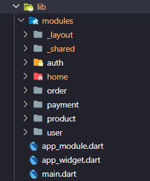

# Simple Messager using Micro-Service Arch and App Clean Arch

 
This project was developed to enhance skills and evaluate the microservices architecture using NestJs. The goal was to prepare the back-end to integrate seamlessly with a web interface and a Flutter application.

---
  

## ✔️ Topics Covered in Front-End 
 - Built with Flutter/Dart.
 - Clean architecture.
 - Modularization and dependency injection using Flutter Modular 6.
 - State management using the BLoC pattern.
 - User session management using JWT tokens.
 - File upload.
 - Form validation using the Validatorless package.
 - Interceptors for maintaining user sessions using Dio.
 - Nested navigation using the Modular RouterOutlet.
 - Responsiveness using Flutter's MediaQuery.
---
  

## ✔️ Topics Covered in Front-End 
 - Built with Javascript.
 - Clean architecture.
 - Modularization and dependency injection using NestJS. 
 - Micro-Service Archtecture
---
  

## 🔗 Links 
Some links used in this project:  
 - [Flutter Modular 6](https://modular.flutterando.com.br/)
 - [Package Validatorless](https://pub.dev/packages/validatorless)
 - [Package Brasil Fields](https://pub.dev/packages/brasil_fields) 
---
  

  

## 🧩 Clean Architecture
Clean Architecture is an approach to designing software systems that emphasizes organizing code into well-defined layers, making the software more modular, testable, and easy to maintain. Additionally, Clean Architecture promotes the application of principles such as the Single Responsibility Principle and the Dependency Inversion Principle to create flexible and highly cohesive systems.

 

  

More about clean arch: 
- [A good article on the topic](https://betterprogramming.pub/the-clean-architecture-beginners-guide-e4b7058c1165)
- [Another good article](https://blog.cleancoder.com/uncle-bob/2012/08/13/the-clean-architecture.html)
 
---
  

## 🏷️ Modules and Layer Organization
The idea behind using these approaches may seem initially complicated and may spread code across hundreds of files and folders. However, it makes sense for applications with the following requirements:

- Scalability: should be ready for new features.  
- Testing: should make easy to automate tests.
- Teams: should be easy to manage several groups of people changing the same code base.
- Reuse: should be simple reusing modules from other projects (e.g., shared, authentication, profile).
- MicroApp: should facilitates the conversion to micro-apps, where each module can become a package.

Modules/Functionalities / Layer Folders / Shared Module

 

   
   
   

Below is an example of the Product module. Navigation and dependency injection:
When accessing a screen/page of a module, dependencies are loaded as needed. When leaving the screen, dependencies are removed from memory.

 
Note that a module can contain multiple screens/pages and even sub-modules if necessary.  
  

For more basic dependencies shared by all modules, they can be described and exposed in the 'Core Module' concept. Note that these are classes such as http, local storage, shared navigation (centralizes navigation calls, making Modular navigation decoupled):

---
  

## 🛠️ Shared Structures and Decoupling
Modules with an underscore (_) in their name are modules that serve other modules. The idea is to centralize the main dependencies so that they can be easily replaced, a concept known as decoupling.

 
 

The lower layers inject dependencies through their abstract classes, making it easy to replace packages such as Dio for HTTP requests or SharedPreferences for local data storage.

### Layouts e Menu
Another example of a module that is independent but only makes sense to serve other modules is the _layout module.

Flutter Modular offers a feature called RouterOutlet for nested navigation, where screen transitions occur in a specific space within the layout. Below is how the navigation between the routes of each module is defined and composed with the common layout among them.

 

Note that the authentication screen (route /auth) does not share the layout with other routes.

---
  

## 👍🌟 Liked It?
If you liked it or found it useful, feel free to:
- Leave a star.
- Get in touch.
- Contribute with a pull request.
- Clone the repository.

---
  

#
<footer>
  
 Copyright © Moacir Jacomin 

